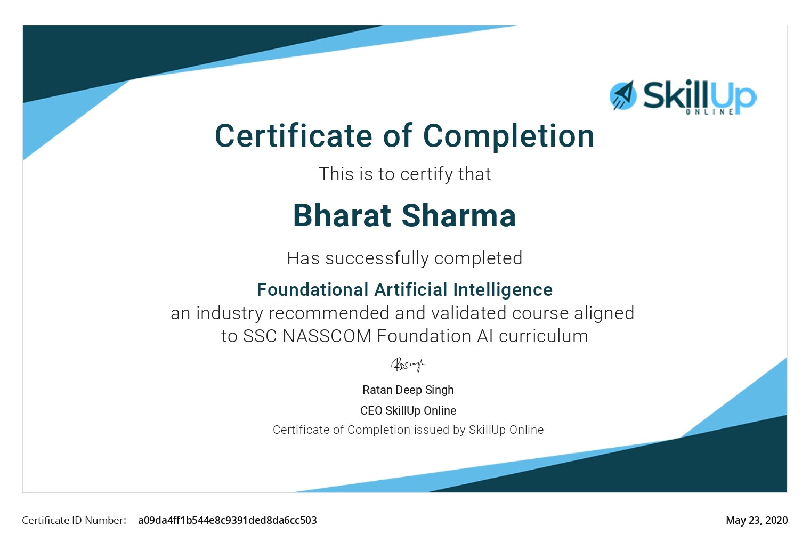
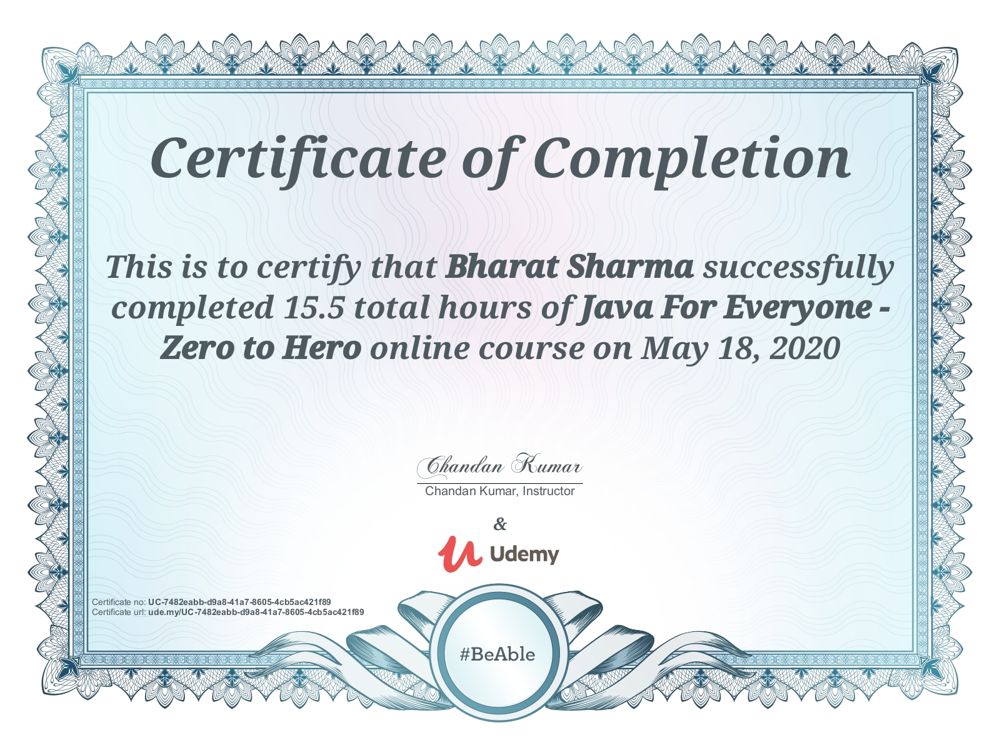
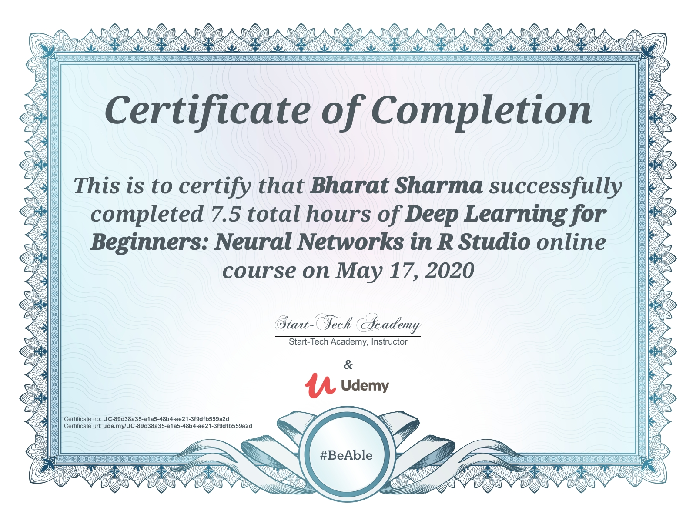

# My Certification Courses
you can find my all certifications on [Certifications Page](https://bharatbrijwasi.github.io/My_Certifications/)
## OOPs Concept
***

## AI
***

## R
*** 

## Big Data
***

## Java
***

## Cicso Networking
***

## Deep Learning
***

